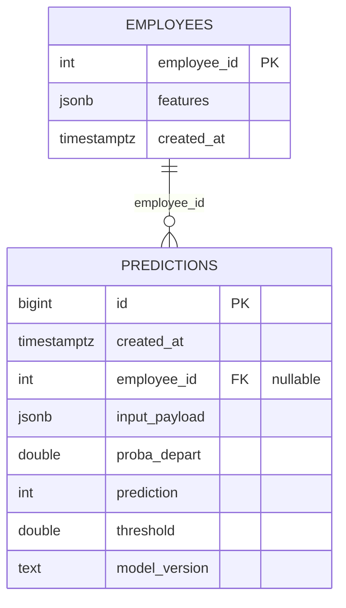

# TechNova Attrition — ML Serving (FastAPI + PostgreSQL + CI/CD)

POC de déploiement d'un modèle de prédiction d'attrition RH sous forme d'API **FastAPI**, avec **traçabilité complète** en base **PostgreSQL**, **tests Pytest** (unit + integration), et **CI/CD** (GitHub Actions → Hugging Face Spaces).

> Objectif de la mission : rendre un modèle ML utilisable en production, avec de bonnes pratiques d'ingénierie logicielle (tests, DB, CI/CD, secrets, docs).

---

## Liens (à renseigner)
- **API (prod / Hugging Face) — Swagger** : `https://huggingface.co/spaces/bijeytis/PrjPerso_hr-attrition-mlops`
- **Repo GitHub** : `https://github.com/Ben-Girard/PrjPerso_hr-attrition-mlops`

---

## Quickstart (2–3 minutes en local)

### Pré-requis
- Python 3.12+
- Docker Desktop
- `uv` installé (gestion deps + exécution)

### 0) Installer les dépendances
```bash
uv sync --group dev --group db --group serve
```

### 1) Configurer l'environnement
Créer `.env.local` (non versionné) à partir de `.env.example` :

```bash
cp .env.example .env.local
```

Puis éditer `.env.local` (au minimum `API_KEY` et `DATABASE_URL`).

### 2) Démarrer PostgreSQL (local)
```bash
docker compose up -d
uv run python scripts/db_apply_schema.py
uv run python scripts/db_seed_employees.py
uv run python scripts/db_smoke_test.py
```

### 3) Lancer l'API en local
```bash
uv run uvicorn technova_attrition.api.main:app --reload --host 0.0.0.0 --port 8000
```

Ouvrir Swagger :
- http://localhost:8000/docs

### 4) Faire une prédiction (curl)
```bash
curl -X POST "http://localhost:8000/predict" \
  -H "Content-Type: application/json" \
  -H "X-API-Key: <API_KEY>" \
  -d '{"features":{"age":21,"genre":1,"revenu_mensuel":3447,"statut_marital":"Célibataire","departement":"Commercial","poste":"Représentant Commercial","nombre_experiences_precedentes":1,"annee_experience_totale":3,"annees_dans_l_entreprise":3,"annees_dans_le_poste_actuel":2,"satisfaction_employee_environnement":3,"note_evaluation_precedente":3,"niveau_hierarchique_poste":1,"satisfaction_employee_nature_travail":3,"satisfaction_employee_equipe":3,"satisfaction_employee_equilibre_pro_perso":3,"eval_number":"E_669","note_evaluation_actuelle":3,"heure_supplementaires":0,"augementation_salaire_precedente":"11 %","eval_number_int":669,"nombre_participation_pee":0,"nb_formations_suivies":2,"nombre_employee_sous_responsabilite":1,"code_sondage":669,"distance_domicile_travail":22,"niveau_education":1,"domaine_etude":"Entrepreunariat","frequence_deplacement":"Occasionnel","annees_depuis_la_derniere_promotion":1,"annes_sous_responsable_actuel":2,"employee_id_anon":"emp_c8b594649875c70a","changement_poste":1,"proba_chgt_experience_par_an":0.3333333333,"proba_chgt_experience_par_an_adulte":0.3333333333,"ratio_experience_vie_adulte":1.0,"evolution_note":0}}'
```

### 5) Vérifier le logging DB (preuve de traçabilité)
```bash
docker exec -it technova_postgres psql -U technova -d technova_attrition \
  -c "SELECT id, created_at, employee_id, proba_depart, prediction, threshold, model_version FROM predictions ORDER BY created_at DESC LIMIT 5;"
```

---

## Architecture (vue d'ensemble)

**FastAPI** sert un modèle ML gelé (pipeline scikit-learn).

**PostgreSQL** stocke :
- Les features employé (table `employees`) pour `/predict_by_id`
- L'historique complet des prédictions (table `predictions`) pour audit/traçabilité

**Artefacts modèles** :
- `models/pipeline.joblib` : pipeline complet (preprocess + modèle)
- `models/expected_features.json` : source de vérité des features attendues (évite mismatch train/serve)

**Flux** :
1. Client → API (`/predict` ou `/predict_by_id/{id}`)
2. API aligne/ordonne les features selon `expected_features.json` (features manquantes complétées par null)
3. API calcule `predict_proba` → `proba_depart`
4. API applique le seuil (`MODEL_THRESHOLD`) → `prediction` (0/1)
5. API loggue l'entrée + sortie dans `predictions`

---

## Base de données (serving)

### Schéma (Mermaid ER)



### Scripts DB
- **Schéma** : `sql/serving/01_schema.sql` (idempotent)
- **Seed (safe)** : `data/processed/api_test/X_test_sample.json` (≤10 lignes)

**Scripts** :
- `scripts/db_apply_schema.py`
- `scripts/db_seed_employees.py`
- `scripts/db_smoke_test.py`

Plus de détails : [docs/DB.md](docs/DB.md)

---

## API (FastAPI)

### Endpoints
- `GET /health` : statut API
- `POST /predict` : prédiction depuis un payload JSON (features fournies)
- `POST /predict_by_id/{employee_id}` : features lues depuis `employees`, puis prédiction
- `GET /history` : historique global des prédictions
- `GET /history/{employee_id}` : historique d'un employé

### Format d'entrée (IMPORTANT)
Le payload doit être encapsulé :
```json
{
  "features": {
    "age": 21,
    "genre": 1,
    "revenu_mensuel": 3447,
    "statut_marital": "Célibataire",
    "departement": "Commercial",
    "poste": "Représentant Commercial",
    "nombre_experiences_precedentes": 1,
    "annee_experience_totale": 3,
    "annees_dans_l_entreprise": 3,
    "annees_dans_le_poste_actuel": 2,
    "satisfaction_employee_environnement": 3,
    "note_evaluation_precedente": 3,
    "niveau_hierarchique_poste": 1,
    "satisfaction_employee_nature_travail": 3,
    "satisfaction_employee_equipe": 3,
    "satisfaction_employee_equilibre_pro_perso": 3,
    "eval_number": "E_669",
    "note_evaluation_actuelle": 3,
    "heure_supplementaires": 0,
    "augementation_salaire_precedente": "11 %",
    "eval_number_int": 669,
    "nombre_participation_pee": 0,
    "nb_formations_suivies": 2,
    "nombre_employee_sous_responsabilite": 1,
    "code_sondage": 669,
    "distance_domicile_travail": 22,
    "niveau_education": 1,
    "domaine_etude": "Entrepreunariat",
    "frequence_deplacement": "Occasionnel",
    "annees_depuis_la_derniere_promotion": 1,
    "annes_sous_responsable_actuel": 2,
    "employee_id_anon": "emp_c8b594649875c70a",
    "changement_poste": 1,
    "proba_chgt_experience_par_an": 0.3333333333,
    "proba_chgt_experience_par_an_adulte": 0.3333333333,
    "ratio_experience_vie_adulte": 1.0,
    "evolution_note": 0
  }
}
```

### Authentification
Les endpoints de prédiction nécessitent un header :
```
X-API-Key: <API_KEY>
```
Sinon : `401 Unauthorized`

Plus de détails + exemples : [docs/API.md](docs/API.md)

---

## Tests & couverture

### Lancer la suite de tests
```bash
uv run pytest -q
```

### Générer un rapport de couverture (HTML)
```bash
uv run pytest --cov=src --cov-report=term-missing --cov-report=html:reports/coverage_html
```

Le rapport HTML est généré dans : `reports/coverage_html/index.html`

Plus de détails : [docs/TESTING.md](docs/TESTING.md)

---

## CI/CD (GitHub Actions → Hugging Face)

Le pipeline CI/CD :
- Installe l'environnement (`uv`)
- Lance `pytest`
- Déploie automatiquement sur Hugging Face Spaces lors d'un push sur `main`

**Secrets côté GitHub (Actions)** :
- `HF_TOKEN` : token Hugging Face
- `HF_SPACE` : identifiant du Space (`user/space-name`)

**Secrets côté Hugging Face (Space → Variables & secrets)** :
- `DATABASE_URL`
- `API_KEY`
- `MODEL_THRESHOLD`
- `MODEL_VERSION`

Plus de détails : [docs/DEPLOYMENT.md](docs/DEPLOYMENT.md)

---

## Sécurité & bonnes pratiques (résumé)

- Aucun secret dans Git (`.env.local`, `.env.supabase` ignorés)
- Données RH : on ne seed jamais le dataset complet, uniquement un sample safe (≤10 lignes)
- Traçabilité : chaque prédiction est loggée (payload exact + proba + seuil + version)
- Auth API key : accès contrôlé via `X-API-Key`

Plus de détails : [docs/SECURITY.md](docs/SECURITY.md)

---

## Structure du repo (repères)
```
.
├── data/
│   └── processed/api_test/          # samples versionnés pour tests/démo
├── docs/                            # documentation (API/DB/Deploy/Tests/Security)
├── models/
│   ├── expected_features.json       # versionné
│   ├── model_card.json              # versionné
│   └── pipeline.joblib              # requis à l'exécution
├── scripts/                         # scripts CLI DB (apply/seed/smoke)
├── sql/serving/                     # schéma DB serving + checks
├── src/technova_attrition/          # code python (API, DB, ML serving)
├── tests/                           # unit + integration
├── docker-compose.yml               # PostgreSQL local
├── Dockerfile                       # image de serving
├── pyproject.toml / uv.lock         # dépendances
└── README.md
```

---

## Troubleshooting

- **401 Unauthorized** : header `X-API-Key` manquant ou incorrect.
- **422 Unprocessable Entity** : payload invalide (attendu : `{"features": {...}}`).
- **OperationalError DB** : `DATABASE_URL` incorrect, DB pas démarrée, ou SSL requis (Supabase).
- **relation predictions does not exist** : schéma non appliqué → `db_apply_schema.py`.
- **pipeline.joblib not found** : l'artefact modèle est requis à l'exécution (voir section "Modèle").

---

## Modèle servi (rappel)

- **Type** : Logistic Regression (scikit-learn)
- **Pipeline complet** : preprocessing + modèle
- **Sortie** : probabilité `proba_depart`
- **Décision** : `prediction` via seuil `MODEL_THRESHOLD` (configurable sans réentraîner)

**Artefacts** :
- `models/pipeline.joblib` (pipeline gelé)
- `models/expected_features.json` (features attendues, source de vérité)

---

## Documentation complète

- [docs/API.md](docs/API.md) : endpoints + exemples (curl + Python)
- [docs/DB.md](docs/DB.md) : schéma + scripts + seed + requêtes
- [docs/DEPLOYMENT.md](docs/DEPLOYMENT.md) : local → Docker → HF + CI/CD
- [docs/TESTING.md](docs/TESTING.md) : stratégie tests + couverture
- [docs/SECURITY.md](docs/SECURITY.md) : secrets + auth + data safety
- [docs/RUNBOOK.md](docs/RUNBOOK.md) : checklist "évaluation / soutenance"
