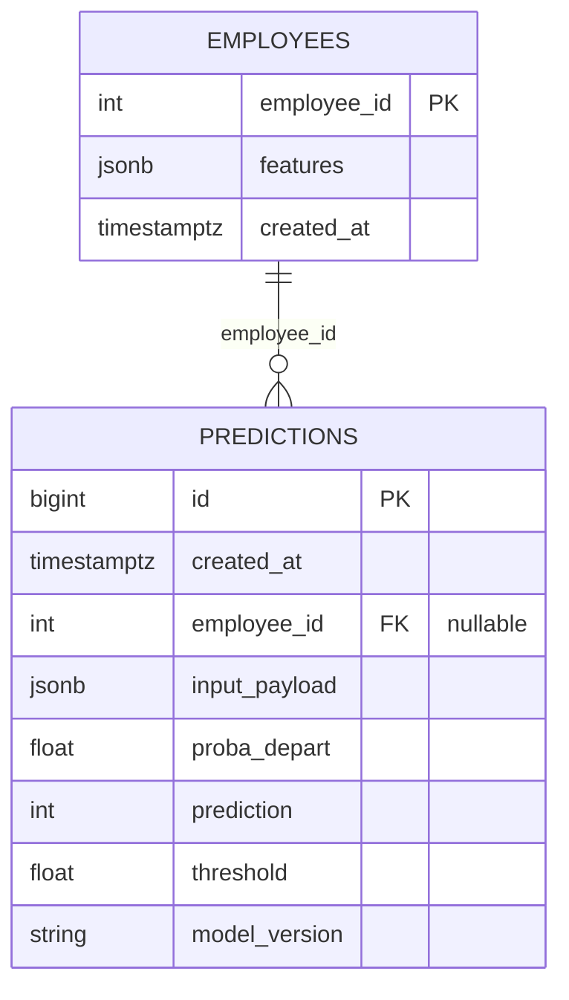

# Database (PostgreSQL) — Serving Schema & Operations

## Objectif
Cette base sert de **backend de serving** pour l'API de prédiction :
- Stocker des **features employé** (source pour `/predict_by_id`)
- Enregistrer **toutes les prédictions** (audit/traçabilité)
- Permettre d'exposer un historique via `/history`

> Règle projet : **toute interaction avec le modèle doit être loggée en DB**.

---

## Schéma (ERD)



## Tables

### 1) employees
Stocke un "profil" minimal d'employé sous forme JSONB.

| Champ       | Type          | Rôle                          |
|-------------|---------------|-------------------------------|
| `employee_id` | INTEGER (PK) | identifiant stable            |
| `features`    | JSONB        | features d'entrée du modèle   |
| `created_at`  | TIMESTAMPTZ  | timestamp insertion           |

**Utilisation** : `/predict_by_id/{employee_id}` récupère `features`.

### 2) predictions
Journal des prédictions. Chaque appel crée une nouvelle ligne.

| Champ          | Type              | Rôle                          |
|---------------|-------------------|-------------------------------|
| `id`           | BIGSERIAL (PK)    | id de prédiction              |
| `created_at`   | TIMESTAMPTZ       | timestamp appel               |
| `employee_id`  | INTEGER (FK nullable) | lien optionnel vers employees |
| `input_payload`| JSONB             | payload exact envoyé au modèle|
| `proba_depart` | DOUBLE            | probabilité prédite           |
| `prediction`   | SMALLINT          | classe 0/1                    |
| `threshold`    | DOUBLE            | seuil utilisé                 |
| `model_version`| TEXT              | version modèle                |

**Pourquoi `employee_id` nullable ?**
- `/predict` peut être fait sans ID (payload manuel)
- `/predict_by_id` utilise l'ID

**Pourquoi JSONB ?**
- Les features ML évoluent souvent (ajout/retrait). Stocker en JSONB permet :
  - Schéma flexible
  - Robustesse pour les POC
  - Audit complet des entrées réellement envoyées

**Index / performance**
Le schéma crée généralement :
- Index sur `predictions.created_at`
- Index sur `predictions.employee_id`
- Éventuellement index GIN sur JSONB si besoin (non requis pour ce POC)

---

## Scripts & SQL

### SQL
- `sql/serving/01_schema.sql` : création tables + index (idempotent)
- `sql/serving/02_seed_checks.sql` : requêtes d'inspection rapide (optionnel)

### Scripts Python
- `scripts/db_apply_schema.py` : applique `01_schema.sql`
- `scripts/db_seed_employees.py` : seed minimal depuis `X_test_sample.json`
- `scripts/db_smoke_test.py` : connectivité + counts

### Démarrage local (Docker)
**Lancer PostgreSQL** :
```bash
docker compose up -d
```

**Appliquer le schéma** :
```bash
uv run python scripts/db_apply_schema.py
```

**Seed minimal** :
```bash
uv run python scripts/db_seed_employees.py
```

**Smoke test** :
```bash
uv run python scripts/db_smoke_test.py
```

---

## Politique de seed (IMPORTANT — données RH)
On ne seed jamais le dataset complet (sensibilité RH).
On seed uniquement un sample safe et versionné :
- `data/processed/api_test/X_test_sample.json` (≤10 lignes)

Ce sample sert à :
- Tests d'intégration API↔DB
- Démo `/predict_by_id`
- Validation rapide en local/CI

---

## Requêtes SQL utiles (preuves pour test)

### 1) Vérifier que le seed est présent
```sql
SELECT COUNT(*) FROM employees;
```

### 2) Vérifier qu'une prédiction est loggée
```sql
SELECT COUNT(*) FROM predictions;
```

### 3) Afficher les dernières prédictions
```sql
SELECT id, created_at, employee_id, proba_depart, prediction, threshold, model_version
FROM predictions
ORDER BY created_at DESC
LIMIT 10;
```

**Commande docker pratique** :
```bash
docker exec -it technova_postgres psql -U technova -d technova_attrition \
  -c "SELECT id, created_at, employee_id, proba_depart, prediction, threshold, model_version FROM predictions ORDER BY created_at DESC LIMIT 10;"
```

---

## Supabase / DB distante (option)
Pour Supabase, `sslmode=require` est souvent nécessaire :
```
DATABASE_URL=postgresql+psycopg://postgres:<password>@db.<ref>.supabase.co:5432/postgres?sslmode=require
```

Ensuite exécuter les mêmes scripts (`apply_schema`, `seed`, `smoke_test`) en pointant vers `.env.supabase`.

---

## Intégrité & traçabilité
- Chaque prédiction → une ligne dans `predictions`
- On garde le payload exact (`input_payload`) → audit complet
- `model_version` + `threshold` sont loggés → reproductibilité et diagnostic
